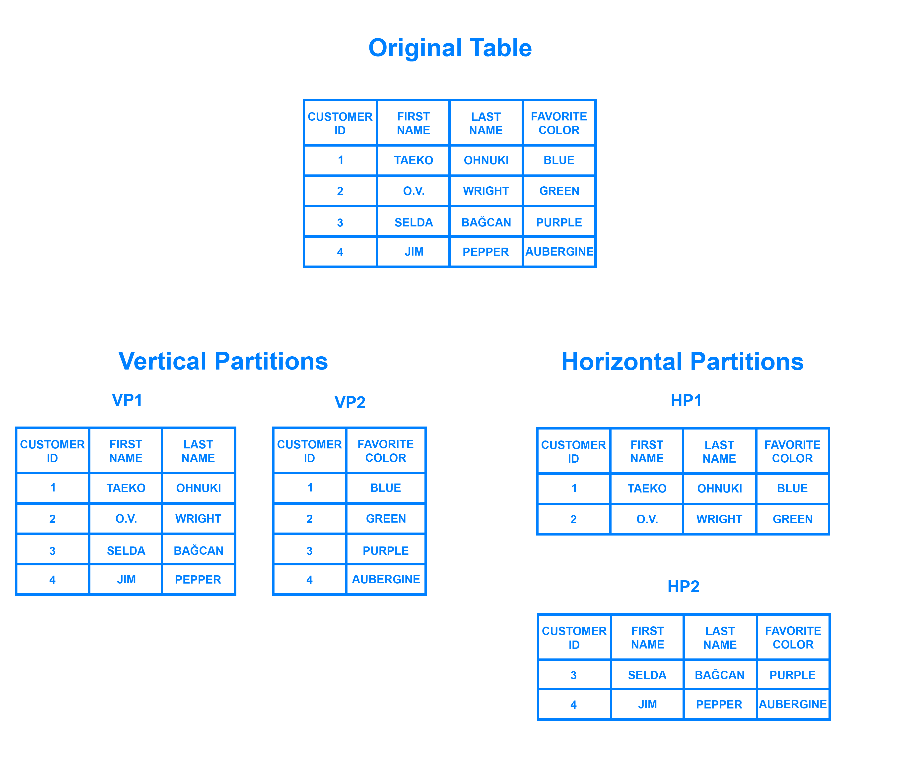
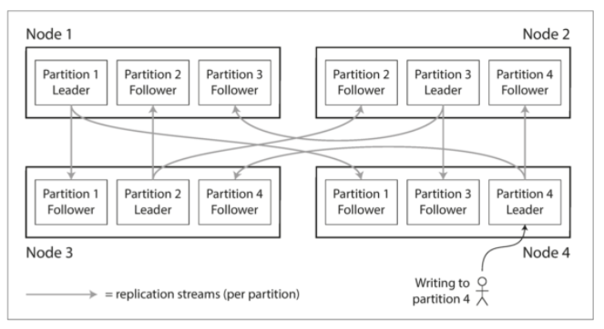

在看书之前有 2 点先提及一下：

第一点是先参考 coolshell 的一篇文章，讨论分布式系统的一致性模型：

https://coolshell.cn/articles/10910.html

简而言之就是，为了数据高可用，我们需要备份 backup，而备份又牵扯到数据一致性问题。

数据一致性有 3 种：Weak 弱一致性，...

然后一写多读 one master - multiple slaves 或者
多写多读 - multiple masters

同时如果一个事务需要多个 step，且这多个 step 常常发生在多个服务器上，那么
需要 2PC(2 Phase Commit) 两阶段提交：

a. 第一阶段，协调者 Coordinator 会要求各个节点执行操作。各个参与者开始事务执行
的准备工作：比如为资源上锁，预留资源，写 Undo/Rego log

b. 第二阶段，如果所有的参与者都回应"可以提交"，那么，协调者向所有的参与者发送提交命令，
各个节点执行，结束 global transaction;如果有一个参与者回应"拒绝提交"或者无回复，那么
协调者向所有参与者发送回滚操作 rollback。

第二点是参考 DigitalOcean 的这篇文章 https://www.digitalocean.com/community/tutorials/understanding-database-sharding 以及 SO 的这 2 个回答 https://stackoverflow.com/questions/20771435/database-sharding-vs-partitioning/20772839 ，https://stackoverflow.com/questions/11707879/difference-between-scaling-horizontally-and-vertically-for-databases

回答 Partitioning / Scaling / sharding 之间的关系是什么？

1. Scale 分为 2 种，一种是 Vertical Scale，就是给机器加更多的内存和 CPU；另一种是 Horizontal 
Scale，就是给应用增加更多的机器，其中 Horizontal Scale 经常用到的一种方法是 Partition。

2. Partition 分为 2 种，一种是 Vertical Partition，把一个数据库按照不同的列进行拆分；
另一种是 Horizontal Partitions，也叫 Range-based Partitions，是把一个数据库按照不同的行
进行拆分。

3. 如上所述，Partition 是比较笼统的一种叫法，而 Sharding 则是 Horizontal Partitions 的一种具体
表现形式。Sharding 有三种方法：hash-based sharding,range based sharding,directory-based sharding(需要一个 `look-up table`)

4. Partition 与 Replication 经常一起使用，具体如下图所示：

主要是第二章的内容需要仔细看：

