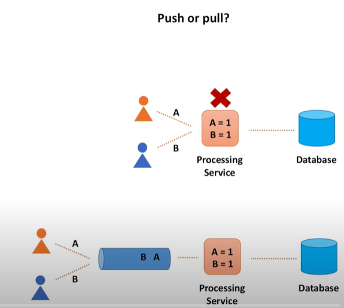

参考这个链接：

https://www.youtube.com/watch?v=hsKwiIc7EXU&list=PLBtMh4xfa9FHSMKKgPZcPfoPbZmND5PC-

1. 练习网址：

Whimsical.com

2. 设计时需要考虑到的算法：

- Scenario
- Service
- Storage
- Scale

第一点：

对 Scenario，要做的是：`Outline use cases,constraints,and assumptions`

要问的基本问题包括 Who/How

a. 系统是什么？what is the system
b. 谁来使用？who is going to use it
c. 系统如何被使用？ how it's going to be used
d. 系统的期待输入和输出是什么？ What is the expected input and output of the system

以及也可以问一些量化问题：

a. how much data we need to handle(这里更具体一些，比如 dau daily active user,rpq request per second)

第二点：

对 Service 和 Storage，主要是包括两方面，一是 high level design，另一个是 design core components

对 high level design，要进行 API 和数据 schema 设计，
画出主要的 components 并连接起来，说明想法 justify the idea

对 design core components，是在 high level 之后再 dive deep into core components
比如要设计一个 tinyurl，就可以探讨如下话题：

a. MD5 和 Base62 算法的差异
b. 哈希冲突如何解决 hash collisions
c. 选择 SQL 还是 NoSQL
d. 场景是读多还是写多，如何进行相应优化

第三点：对 Scale，要解决如下问题

a. load balancer
b. 对应用：horizontal scaling/vertical scaling
b. 对数据库：horizontal partition/vertical partition，hash 的 key 的选择
c. cacheing, 通常牵扯到 distributed cache 以及一致性哈希 consistent hash 算法

---

系统设计很多时候都需要 trade-off，这里讨论几组 trade-off:

`Performance vs Scalability` 和 `Latency vs throughput` 以及 `Availability vs Consistency`

1. 首先讨论 `Performance vs Scalability`

Performance 好通常有两种表现：

a. 可以处理更多的任务 handle more units of work
b. 可以处理单个更大的 unit : handle larger units of work

一个系统是 scalable 的说法就是该系统的 performance 随着投入资源的增加而增加

2. 再次讨论 `Latency vs throughpu`

这两者显然是矛盾的，我们通常希望达到 `Maximal throughput with acceptable latency`

3. 最后讨论 `Availability vs Consistency`

这里就要讨论到经典的 CAP 定理：CAP theorem
对一个分布式系统，在三个属性里，最多只能同时满足两个：

- 一致性 concistency: 要求 every read receives the most recent write results or an error
- 可用性 availability: 要求 every request must receive an response，至于 response 是否是最新的不做要求
- 分区容错性 Partition Tolerance: 要求该应用部署在多个 partitions 上，如果因为各种原因一个 partition 不可以，其他部分仍然可以工作

一般来说 `p` 是一定要选的，所以实际上只有两种情况：

- `cp` : 适用于对一致性要求很高的系统，比如 banking account，可以允许一次读不出结果，但不能允许错误的结果

- `ap` : 适用于允许最终一致性 eventual consistency 的系统，比如 view count。Responses return the most readily available version of the data available on any node, which might not be the latest.

---

一致性的几种情况：

根据 CAP 理论，一致性定义为：`Every read receives the most recent write or an error.`

1. 弱一致性 weak consistency

完全不保证。after a write, reads may or may not see it. 只能说会尽力保证 a best effort approach is taken

应用场景：memcache / video chat 等允许数据丢失的情况

2. 最终一致性 eventual consistency

保证最终相等。最终时间在 ms(million seconds)之间，数据被异步复制 data is replicated asynchronously

应用场景：DNS / Email 等 highly available 的场景下

3. 强一致性 

数据被同步传输 Data is replicated synchronously

应用于 文件系统(eg HDFS)/数据库(RDBMS)/

---

2. sharding / partitioning 详细解释：

同时来回答：how to scale the system

---

Push 和 Pull

对信息流,push 和 pull 是一种思路：

对其他，是另一种思路：

比如要求一个 youtube video 的点击数量

push ：直接把 click information 发送给 processing service，然后
processing service 把处理后的数据发送给 database

pull : 把 click information 发送个一个 tempstorage service，然后
processing service 定期从 tempstorage service 里 pull 数据，再把
处理后的数据发送给 database

第二种方法 pull 很显然更好。第一种方法在 processing service crash 的
情况下会丢失数据

---

关于 system design 的 load balancing 

service registry（zookeeper)

consitent hashing explanations

倒排索引(inverted index)
