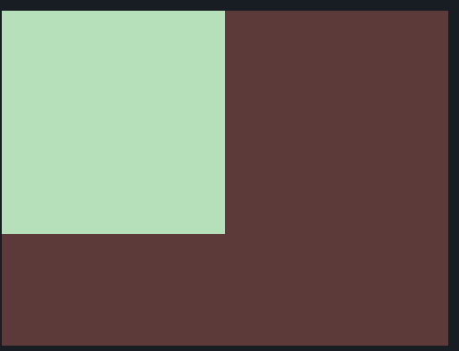

This is the objective:



How we do it :


1. Solution 1 :

Use absolute value:

```html

<div>
  </div>
<style>
  body {
    margin:0;
    background: #5d3a3a;
  }
  
  div {
    width: 200px;
    height: 200px;
    background: #b5e0ba;
  }
  
</style>

```